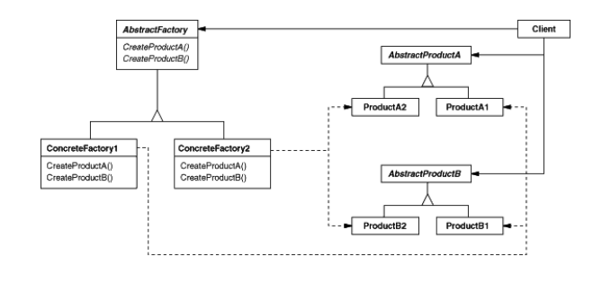
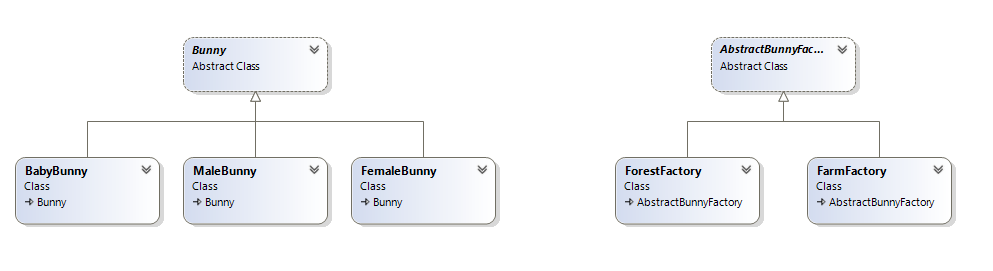

# Abstract Factory

## Намерение
Осигурява интерфейс за създаване на семейства от обекти, които са свързани и зависими помежду си, без да се посочват техните конкретни класове.
(Също известен като Kit)

## Мотив
С цел да се предотврати модуларизацията се използва този шаблон. 
Също се използва в системи, които често подлежат на промени.

## Участници
#### Abstract Factory:
Декларира интерфейс за операциите по създаването на абстрактни продукти.
#### Concrete Factory:
Имплементира опериациите, по които ще се създават конкретните продукти.
#### Abstract Product:
Декларира интерфейс за даден тип обект.
#### Concrete Product:
Дефинира конкретния обект, който ще бъде създаден от конкретната фабрика.
Имплементира Abstract Product.
#### Client:
Използва само интерфейси, декларирани от Abstract Factory и Abstract Product.

## Приложимост
Използвайте шаблона Abstract Factory, когато:
*   Дадена система трябва да бъде независима от това как нейните продукти създадени.	
*   Системата трябва да бъде конфигурирана с една от множеството семейства от обекти.
*   Когато искаш да предоставиш клас библиотека от обекти, но искаш да бъдат известни само техните интерфейси, а не тяхните имплементации.

## Свързани шаблони
Abstract Factory класовете са често имплементирани с Factory Method шаблонът, но те могат също така да бъдат имплементирани, използвайки Prototype шаблона.
Concrete Factory е чесно Sigleton.

## Структура

## Пример
Abstract Factory за създаване на заици

###### Abstract Bunny
~~~c#
public abstract class Bunny
{
	protected abstract string Habitation { get; }
	protected string Name { get; set; }
	protected double Weight { get; set; }
	protected string Color { get; set; }
	protected List<string> Foods { get; set; }

	protected Bunny(string name, double weight, string color, List<string> foods)
	{
		this.Name = name;
		this.Weight = weight;
		this.Color = color;
		this.Foods = new List<string>(foods);
	}

	public override string ToString()
	{
		var result = new StringBuilder();
		result.AppendLine(this.Habitation);
		result.AppendLine("Name: " + this.Name);
		result.AppendLine("Weight: " + this.Weight);
		result.AppendLine("Color: " + this.Color);
		result.AppendLine("Foods: " + string.Join(", ", this.Foods));
		return result.ToString();
	}
}
~~~

###### Abstract Bunny Factory
~~~c#
public abstract class AbstractBunnyFactory
{
	public abstract FemaleBunny MakeFemaleBunny();

	public abstract MaleBunny MakeMaleBunny();

	public abstract BabyBunny MakeBabyBunny();
}
~~~

###### Bunnies Classes (Male, Female and Babby Bunny)
~~~c#
public class MaleBunny : Bunny
{
	private readonly string habitation;

	public MaleBunny(string name, double weight, string color, List<string> foods, string habitation)
		: base(name, weight, color, foods)
	{
		this.habitation = habitation;
	}

	protected override string Habitation
	{
		get
		{
			return string.Format("Male bunny lives in {0}", this.habitation);
		}
	}
}
~~~

~~~c#
public class FemaleBunny : Bunny
{
	private readonly string habitation;

	public FemaleBunny(string name, double weight, string color, List<string> foods, string habitation)
		: base(name, weight, color, foods)
	{
		this.habitation = habitation;
	}
	protected override string Habitation
	{
		get
		{
			return string.Format("Female bunny lives in {0}", this.habitation);
		}
	}
}
~~~

~~~c#
public class BabyBunny : Bunny
{
	private readonly string habitation;

	public BabyBunny(string name, double weight, string color, List<string> foods, string habitation)
		: base(name, weight, color, foods)
	{
		this.habitation = habitation;
	}

	protected override string Habitation
	{
		get
		{
			return string.Format("Babby bunny lives in {0}", this.habitation);
		}
	}
}
~~~

###### Bunnies Factories (Forest and Farm)
~~~c#
public class ForestFactory : AbstractBunnyFactory
{
	private const string Name = "Back Forest";

	public override FemaleBunny MakeFemaleBunny()
	{
		var foods = new List<string> { "foxes", "small trees" };
		var female = new FemaleBunny("Wild Maria", 13.2f, "colorful", foods, Name);
		return female;
	}

	public override MaleBunny MakeMaleBunny()
	{
		var foods = new List<string> { "tigers", "elephants" };
		var male = new MaleBunny("Wild Johny", 23.2f, "invisible", foods, Name);
		return male;
	}

	public override BabyBunny MakeBabyBunny()
	{
		var foods = new List<string> { "zombies" };
		var baby = new BabyBunny("Unknow", 21.5f, "pink", foods, Name);
		return baby;
	}
}
~~~

~~~c#
public class FarmFactory : AbstractBunnyFactory
{
	private const string Name = "Pesho's Farm";

	public override FemaleBunny MakeFemaleBunny()
	{
		var foods = new List<string> { "grass", "carrots", "little bunny babies" };
		var female = new FemaleBunny("Maria", 3.2f, "white", foods, Name);
		return female;
	}

	public override MaleBunny MakeMaleBunny()
	{
		var foods = new List<string> { "grass" };
		var male = new MaleBunny("Pesho", 3.9f, "brown", foods, Name);
		return male;
	}

	public override BabyBunny MakeBabyBunny()
	{
		var foods = new List<string> { "small carrots" };
		var baby = new BabyBunny("Baby", 1.0f, "white-brown", foods, Name);
		return baby;
	}
}
~~~

###### Usage
~~~c#
public static void Main()
	{
		var myForest = new ForestFactory();
		var myFarm = new FarmFactory();

		var bunnies = new List<Bunny> { 
			myForest.MakeBabyBunny(),
			myForest.MakeMaleBunny(),
			myForest.MakeFemaleBunny(),
			myFarm.MakeBabyBunny(),
			myFarm.MakeMaleBunny(),
			myFarm.MakeFemaleBunny()
		};

		foreach (var bunny in bunnies)
		{
			Console.WriteLine(bunny);
		}
	}
~~~