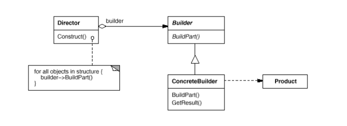
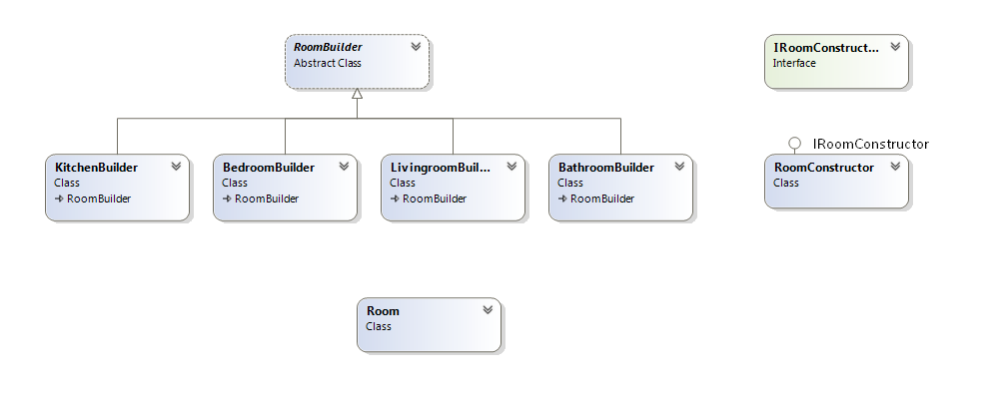

# Builder

## Намерение
Този дизайн шаблон разделя и изолира логиката по създаването на сложен обект от тази тази за неговото представяне и използване. Така един и същ процес на конструиране може да създаде различни обекти, с различно представяне и данни.
Дефинира инстанция за създаването на обекти, но оставя на подкласовете да решат кой точно клас да инстанцират.
Този дизайн шаблон го използваме когато имаме постъпков процес по създаване на обект.

## Мотив
Шаблонът енкапсулира и опростява самото създаване на обекта. Скрива логиката и стъпките по неговото създаване. Чрезнего се предотвратява подаването на множество параметри и dependency-та.

## Участници
#### Director: 
Тук се намира логиката по създаването на обекта. Той знае как се конструира самия обект, стъпките. Той не знае самата имплементация на самите стъпки. Директорът работи с абстракцията (интерфейса) Builder.
#### Builder:
Отговаря и уточнява абстрактен интерфейс за създаването на обекта.
#### Concrete Builder:
Контруира и сглобява части на обекта чрез имплементиране на Builder интерфейса.
Определя и следи за представянето което е създадено.
#### Product:
Представя комплексен обект в процеса на изграждането. Включва в себе си класове, които дефинират отделните съставни части, включително и интерфейси.

## Приложимост
Шаблонът Builder се използва когато 
*   Алгоритъмът за създаването на сложен обект трябва да бъде независим от частите, които съставляват обекта и как те са подредени логически (какви са стъпките по създаването)
*   Процесът по създаване на обекта трябва да позволява създаване на различни обекти.

## Свързани шаблони
Abstract Factory е близък до този шаблон. Разлика е, че Builder се фокусира върху създаването на сложен обект стъпка по стъпка.

## Структура

## Пример
Builder за създаване на различни видове стаи

###### Room
~~~c#
public class Room
{
    private readonly string type;
    private readonly List<string> furniture;

    public Room(string type)
    {
        this.type = type;
        this.furniture = new List<string>();
    }

    public string TypeOfFloor { get; set; }
    public string TypeOfWalls { get; set; }
    public int Doors { get; set; }
    public int Windows { get; set; }

    public void AddFurniture(string furniture)
    {
        this.furniture.Add(furniture);
    }

    public override string ToString()
    {
        var result = new StringBuilder();
        result.AppendLine("Type of room: " + this.type);
        result.AppendLine("Floor: " + this.TypeOfFloor);
        result.AppendLine("Wall: " + this.TypeOfWalls);
        result.AppendLine("Doors: " + this.Doors);
        result.AppendLine("Windows: " + this.Windows);
        result.AppendLine("Furniture: " + string.Join(", ", this.furniture));

        return result.ToString();
    }
}
~~~

###### Abstract Room Builder
~~~c#
public abstract class RoomBuilder
{
    protected RoomBuilder(string roomType)
    {
        this.Room = new Room(roomType);
    }

    public Room Room { get; set; }

    public abstract void BuildFloor();
    public abstract void BuildDoors();
    public abstract void BuildWindows();
    public abstract void BuildWalls();
    public abstract void BuildFurniture();
}
~~~

###### Livingroom
~~~c#
public class LivingroomBuilder : RoomBuilder
{
    public LivingroomBuilder()
        : base("Livingroom")
    {
    }

    public override void BuildFloor()
    {
        this.Room.TypeOfFloor = "Carpet";
    }

    public override void BuildDoors()
    {
        this.Room.Doors = 2;
    }

    public override void BuildWindows()
    {
        this.Room.Windows = 4;
    }

    public override void BuildWalls()
    {
        this.Room.TypeOfWalls = "Wallpaper";
    }

    public override void BuildFurniture()
    {
        this.Room.AddFurniture("Sofa");
        this.Room.AddFurniture("Small table");
        this.Room.AddFurniture("TV");
    }
}
~~~

###### Bedroom
~~~c#
    public class BedroomBuilder : RoomBuilder
{
    public BedroomBuilder()
        : base("Bedroom")
    {
    }

    public override void BuildFloor()
    {
        this.Room.TypeOfFloor = "Parquet and small carpet";
    }

    public override void BuildDoors()
    {
        this.Room.Doors = 2;
    }

    public override void BuildWindows()
    {
        this.Room.Windows = 0;
    }

    public override void BuildWalls()
    {
        this.Room.TypeOfWalls = "Wallpaper";
    }

    public override void BuildFurniture()
    {
        this.Room.AddFurniture("Bed");
        this.Room.AddFurniture("Big TV");
    }
}
~~~

###### Bathroom
~~~c#
public class BathroomBuilder : RoomBuilder
{
    public BathroomBuilder()
        : base("Bathroom")
    {
    }

    public override void BuildFloor()
    {
        this.Room.TypeOfFloor = "Tiles";
    }

    public override void BuildDoors()
    {
        this.Room.Doors = 1;
    }

    public override void BuildWindows()
    {
        this.Room.Windows = 0;
    }

    public override void BuildWalls()
    {
        this.Room.TypeOfWalls = "Tiles";
    }

    public override void BuildFurniture()
    {
        this.Room.AddFurniture("Shower");
        this.Room.AddFurniture("WC");
    }
}
~~~

###### Kitchen
~~~c#
public class KitchenBuilder : RoomBuilder
{
    public KitchenBuilder()
        : base("Kitchen")
    {
    }

    public override void BuildFloor()
    {
        this.Room.TypeOfFloor = "Tiles";
    }

    public override void BuildDoors()
    {
        this.Room.Doors = 1;
    }

    public override void BuildWindows()
    {
        this.Room.Windows = 2;
    }

    public override void BuildWalls()
    {
        this.Room.TypeOfWalls = "Latex";
    }

    public override void BuildFurniture()
    {
        this.Room.AddFurniture("Refrigerator");
        this.Room.AddFurniture("Sink");
        this.Room.AddFurniture("Oven");
        this.Room.AddFurniture("Big table");
        this.Room.AddFurniture("No TV");
    }
}
~~~

###### Director interface
~~~c#
public interface IRoomConstructor
{
    void Construct(RoomBuilder roomBuilder);
}
~~~

###### Director implementation

~~~c#
public class RoomConstructor : IRoomConstructor
{
    public void Construct(RoomBuilder roomBuilder)
    {
        roomBuilder.BuildFloor();
        roomBuilder.BuildDoors();
        roomBuilder.BuildWalls();
        roomBuilder.BuildWindows();
        roomBuilder.BuildFurniture();
    }
}
~~~

###### Usage

~~~c#
public static void Main()
{
    IRoomConstructor constructor = new RoomConstructor();

    RoomBuilder builder = new KitchenBuilder();
    constructor.Construct(builder);
    Console.WriteLine(builder.Room);

    builder = new LivingroomBuilder();
    constructor.Construct(builder);
    Console.WriteLine(builder.Room);

    builder = new BathroomBuilder();
    constructor.Construct(builder);
    Console.WriteLine(builder.Room);
}
~~~