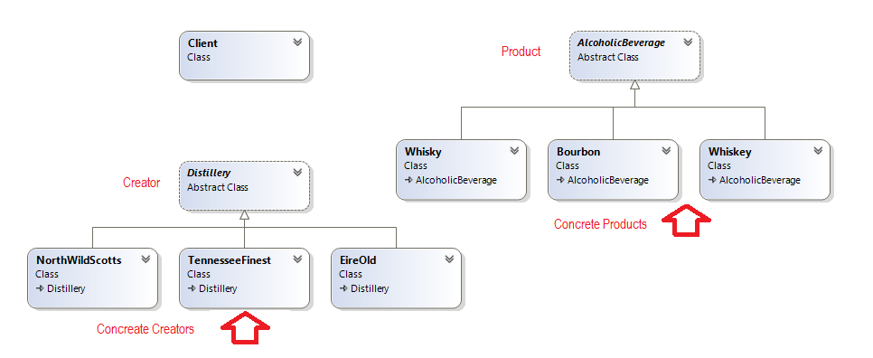

# Factory Method
### Creational Design Pattern

## Role
При Factory Method pattern се задава базов принцип за създаване на обекти, като се оставя всеки един подклас да прецени кои обекти да създаде. Множество класове може да имплементират този принцип като се оставя на клиента да си избере с кой точно доставчик на обекти иска да работи;

## Factory Method pattern се използва когато...
* Гъвкавост е важна.
* Обектите могат да бъдат наследени/доразвити  в подкласове
* Клиент делегира отговорности на подкласове в паралелни йерархии
* Добавянето на нови класове не нарушава Open/Closed Principle

## Също така може да се помисли за използването на други шаблони за дизайн като . . . 
*The Abstract Factory, Prototype, or Builder patterns, които предоставят повече гъвкавост, но и по-високо ниво на сложност

## Implemntation
Клиента получава различно пите в зависимост от това кое Factory си е избрал 

###### Abstract class Distillery – Играе ролята на Creator, който задава базов принципи
~~~c#
public abstract class Distillery
    {
        public abstract AlcoholicBeverage MakeDrink();
    } 
~~~

###### Concreate Creator NorthWildScotts – сам преценява какви обекти да създаде
~~~c#
public class NorthWildScotts : Distillery
    {
        public override AlcoholicBeverage MakeDrink()
        {
            var drink = new Whisky { Taste = "Very Smoky", YearsMatured = 12 };
            return drink;
        }
    }
~~~

###### Abstract Class AlcoholicBeverage
~~~c#
public abstract class AlcoholicBeverage
    {
        public string Taste { get; set; }

        public int YearsMatured { get; set; }

        public string CountryOfOrigin { get; protected set; }

        public override string ToString()
        {
            var drinkAsString = new StringBuilder();
            drinkAsString.AppendFormat("Drink type: {0}", this.GetType().Name);
            drinkAsString.AppendLine();
            drinkAsString.AppendFormat("Tastes: {0}", this.Taste);
            drinkAsString.AppendLine();
            drinkAsString.AppendFormat("Matured for: {0} years", this.YearsMatured);
            drinkAsString.AppendLine();
            drinkAsString.AppendFormat("Made in: {0}", this.CountryOfOrigin);
            return drinkAsString.ToString();
        }
    } 
~~~

###### Concreate Creator Whisky
~~~c#
public class Whisky : AlcoholicBeverage
    {
        public Whisky()
        {
            this.CountryOfOrigin = "Scotland";
        }
    } 
~~~

###### Използване клиента получава различен резултата в зависимост от това с кое Фактори си е избрал да работи
~~~c#
public class Client
    {    
        public static void Main()
        {
            GetDrinkFromDistilley(new EireOld());
            LineSeparator();

            GetDrinkFromDistilley(new NorthWildScotts());
            LineSeparator();

            GetDrinkFromDistilley(new TennesseeFinest());
            LineSeparator();
        }

        private static void GetDrinkFromDistilley(Distillery distillery)
        {
            var drink = distillery.MakeDrink();
            Console.WriteLine(drink.ToString());
        }

        private static void LineSeparator()
        {
            Console.WriteLine(new string('-', 60));
        }
    } 
~~~

###### Демо: [Link to GitHub](https://github.com/clangelov/TelerikAcademyHomework/tree/master/08_High-QualityCode/CreationalPatterns-Homework/demos/WhiskeyFacotryMethodDemo)
