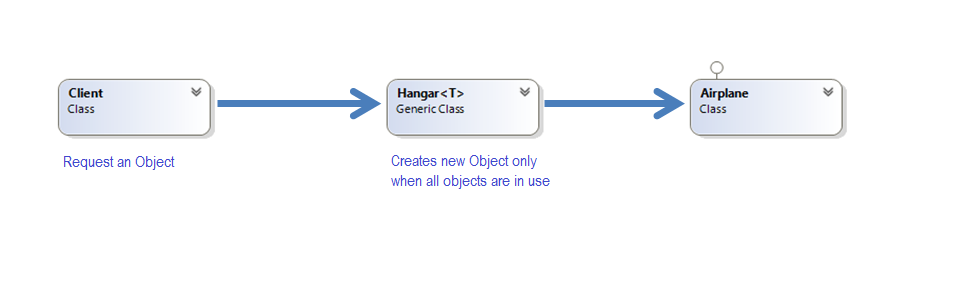

# Object Pool
### Creational Design Pattern

## Описание

Използването на Object Pool Design, може да доведе до значително по-добра производителност на използваното приложение в ситуации когато процеса на създаване на нови обекти е скъп или твърде времеемък или когато имаме често създаване на нови обекти, но сравнително малка част от тях се използват едновременно.

В някои случаи при ползването на Object Pool броя на ресурсите които се пазят може да са ограничени до определена бройка. Ако този брой е достигнат и се иска нова инстанция, може да се хвърли грешка, или заявката да бъде блокирана, докато някой обект не се освободи.

## Implemntation
Демо за използването и презиползването на самолети от Хангар

###### public class Hangar – следи за наличните обекти и тяхното състояние (дали са свободни или се ползват в момента), минимизира броя на създаваните нови обекти
~~~c#
public class Hangar<T> where T : IDisposable, new()
    {
        private readonly List<T> availableAircarfts = new List<T>();
        private readonly List<T> aircraftsInUse = new List<T>();

        public Hangar()
        {
        }

        public T GetAircraft()
        {
            lock (this.availableAircarfts)
            {
                if (this.availableAircarfts.Count != 0)
                {
                    var equipment = this.availableAircarfts[0];
                    this.aircraftsInUse.Add(equipment);
                    this.availableAircarfts.RemoveAt(0);
                    return equipment;
                }
                else
                {
                    var equipment = new T();
                    this.aircraftsInUse.Add(equipment);
                    return equipment;
                }
            }
        }

        public void ReleaseEquipment(T equipment)
        {
            equipment.Dispose();

            lock (this.availableAircarfts)
            {
                this.availableAircarfts.Add(equipment);
                this.aircraftsInUse.Remove(equipment);
            }
        }
    }
~~~

###### public class Airplane 
~~~c#
 public class Airplane : IDisposable
    {
        private readonly DateTime requestedAt = DateTime.Now;

        public DateTime RequestedAt
        {
            get { return this.requestedAt; }
        }

        public string PilotName { get; set; }

        public void Dispose()
        {
            this.PilotName = null;
        }
    }
~~~

###### Използване от страна на клиента в случая на 3-ия пилот Ilmari Juutilainen, той ще използва първият създаден самолет и няма да се налага "скъпото" създаване на нови обекти, а те ще бъдат преизползвани
~~~c#
public class Client
    {
        public static void Main()
        {
            var grafIgnatievo = new Hangar<Airplane>();

            var equipment1 = grafIgnatievo.GetAircraft();
            equipment1.PilotName = "Bubi Hartmann";
            Console.WriteLine(
                "Airplane 1 ordered on {0:MM/dd/yyyy hh:mm:ss.fff tt} used by {1}",
                equipment1.RequestedAt,
                equipment1.PilotName);
            Thread.Sleep(2000);

            var equipment2 = grafIgnatievo.GetAircraft();
            equipment1.PilotName = "Chuck DeBellevue";
            Console.WriteLine(
                "Airplane 2 ordered on {0:MM/dd/yyyy hh:mm:ss.fff tt} used by {1}",
                equipment2.RequestedAt,
                equipment1.PilotName);
            Thread.Sleep(2000);

            grafIgnatievo.ReleaseEquipment(equipment1);

            equipment1.PilotName = "Ilmari Juutilainen";
            Console.WriteLine(
                "Airplane 3 ordered on {0:MM/dd/yyyy hh:mm:ss.fff tt} used by {1}",
                equipment1.RequestedAt,
                equipment1.PilotName);
            Thread.Sleep(2000);
        }
    }
~~~

###### Демо: [Link to GitHub](https://github.com/clangelov/TelerikAcademyHomework/tree/master/08_High-QualityCode/CreationalPatterns-Homework/demos/AircraftObjectPoolDemo)
