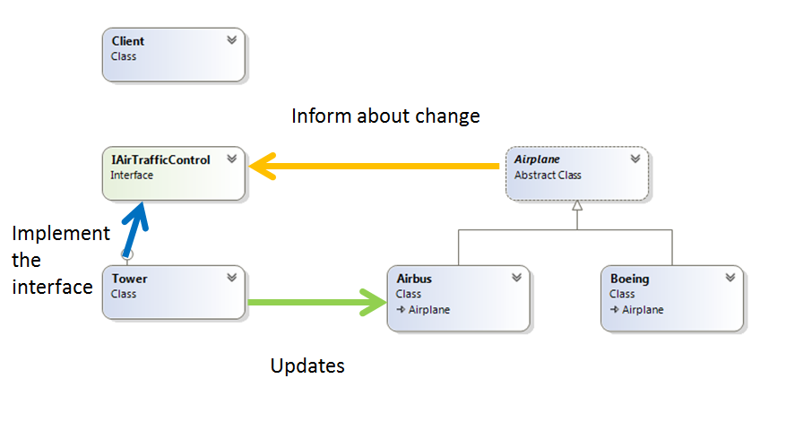

# Mediator
### Behavioral Design Pattern

## Описание
Играе ролята на посредник за обмен на информация между множество сродни обекти. Вместо всеки един от тях да се грижи да предава информацията на всички останали, един посредник го прави вместо тях. Резултатът е, че обектите знаят само за посредника, а не за всички останали обекти.

Също така се избягва употребата на множество if-else-a, които да използваме за да определим как да комуникираме с различните обекти. Медиатора ни позволява ленсо да добавяме нови учстници в комункацията без да нарушаваме open-close принципа.

Благодарение на Медиатора се постига loose coupling между отделните класове, като премахва директаната зависимост между тях. Единствено всеки клас трябва да знае как да предва съобщения към своя медиатор. Това подобрява четимостта на кода, а и неговата поддръжка след като може да подменяме всеки калс или медиатор без нуждата от допълнителни промени. 

Подобен шаблон за дизайн е Observer Pattern

## Implemntation
Кратко демо за комуникацията между отделни самолети през Кулата за въздушен транспорт

###### public abstract class Airplane - определя базовата функционалност на участниците в комуникацията (да ги регистрира при създаване на обект и да регулира комуникацията при промяна на височината), важно е в себе си да съдържа поле със съответния Медиатор 
~~~c#
 public abstract class Airplane
    {
        private readonly IAirTrafficControl airTrafficControl;
        private int currentAltitude;

        protected Airplane(string callSign, IAirTrafficControl airTrafficControl)
        {
            this.CallSign = callSign;
            this.airTrafficControl = airTrafficControl;      
            airTrafficControl.RegisterAircraftUnderGuidance(this);
        }
 
        public string CallSign { get; private set; }
 
        public int CurrentAltitude
        {
            get 
            { 
                return this.currentAltitude; 
            }

            set
            {
                this.currentAltitude = value;
                Console.WriteLine("Airplane {0} changed his altitude to {1}", this.CallSign, this.CurrentAltitude);
                this.airTrafficControl.ReceiveAircraftLocation(this);
            }
        }

        public override bool Equals(object obj)
        {
            if (obj.GetType() != this.GetType())
            {
                return false;
            }

            var incoming = (Airplane)obj;
            return this.CallSign.Equals(incoming.CallSign);
        }

        public override int GetHashCode()
        {
            return this.CallSign.GetHashCode();
        }

        public void WarnOfAirspaceIntrusionBy(Airplane reportingAircraft)
        {
            Console.WriteLine("Airplane {0} has changed his Altitude to avoid Collision", reportingAircraft.CallSign);
        }
    }
~~~

###### public class Airbus (идентичен е с класа Boeing) -  Concrete имплементацията на Airplane
~~~c#
public class Airbus : Airplane
    {
        public Airbus(string callSign, IAirTrafficControl airTrafficControl)
            : base(callSign, airTrafficControl)
        {
        }
    }
~~~

###### public interface IAirTrafficControl - определя всички методи които трябва да се имплементират от отделните Медиатори
~~~c#
public interface IAirTrafficControl
    {
        void ReceiveAircraftLocation(Airplane reportingAircraft);

        void RegisterAircraftUnderGuidance(Airplane aircraft);
    }
~~~

###### public class Tower - поддържа база данни с всики участници в комуникацията, които добавя през метода RegisterAircraftUnderGuidance. Отделните самолети докладват своята позиция до кулата, като тя определя дали тя е валидно спраямо всички останали самоплети (ReceiveAircraftLocation).
~~~c#
public class Tower : IAirTrafficControl
    {
        private IList<Airplane> aircraftUnderGuidance = new List<Airplane>();

        public void ReceiveAircraftLocation(Airplane reportingAircraft)
        {
            foreach (Airplane currentAircraftUnderGuidance in this.aircraftUnderGuidance.Where(x => x != reportingAircraft))
            {
                if (Math.Abs(currentAircraftUnderGuidance.CurrentAltitude - reportingAircraft.CurrentAltitude) < 1000)
                {
                    Console.WriteLine("Air traffic control changed the altitude of {0}", reportingAircraft.CallSign);
                    reportingAircraft.CurrentAltitude += 1000;  
                  
                    // Communicate to the class
                    currentAircraftUnderGuidance.WarnOfAirspaceIntrusionBy(reportingAircraft);
                }
            }
        }

        public void RegisterAircraftUnderGuidance(Airplane aircraft)
        {
            if (!this.aircraftUnderGuidance.Contains(aircraft))
            {
                this.aircraftUnderGuidance.Add(aircraft);
            }
        }
    }
~~~

###### Използване от страна на клиента - необходимо е да създаде инстанция на Медиатора и тя да бъде задавана при инстанцирането на отделните обекти. 
~~~c#
public class Client
    {
        public static void Main()
        {
            IAirTrafficControl tower = new Tower();

            Airplane flightOne = new Airbus("AC159", tower);
            Airplane flightTwo = new Boeing("WS203", tower);

            flightOne.CurrentAltitude = 9000;
            flightTwo.CurrentAltitude = 7500;

            flightOne.CurrentAltitude -= 1000; 
        }
    }
~~~

###### Демо: [Link to GitHub](https://github.com/clangelov/TelerikAcademyHomework/tree/master/08_High-QualityCode/BehavioralPatterns-Homework/demos/MediatorAirplanesDemo) 
